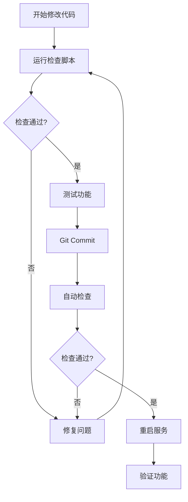

# TCM-AI 开发安全规范

## 🚨 核心原则：不破坏现有功能

### 问题根源

在快速迭代开发中，经常出现"修复A功能，破坏B功能"的情况。主要原因：

1. **依赖关系不清晰**：修改一个模块影响其他模块
2. **缺少自动化检查**：手工测试遗漏关键功能
3. **没有回归测试**：无法及时发现破坏

### 解决方案

## 1. 自动化检查系统 ✅

### 提交前检查（Pre-commit Hook）

**自动触发**：每次 `git commit` 前自动运行

```bash
# 已配置在 .git/hooks/pre-commit
# 检查26个关键项目：
# - 文件完整性（4项）
# - 脚本加载（3项）
# - 关键函数（5项）
# - 异步函数（3项）
# - 兼容层（4项）
# - API端点（4项）
# - 语法完整性（3项）
```

**如何使用**：
```bash
# 正常提交 - 自动检查
git add .
git commit -m "修复xxx"

# 紧急跳过检查（不推荐）
git commit --no-verify -m "紧急修复"
```

### 手动检查

```bash
# 修改代码后，重启前运行
bash scripts/pre_deploy_check.sh

# 或运行完整测试套件
python tests/test_critical_features.py
```

## 2. 关键功能保护清单

### 🔒 绝对不能破坏的功能

| 功能 | 检查点 | 影响 |
|------|--------|------|
| **用户认证** | `performLogin`, `authManager` | 用户无法登录 |
| **医生列表** | `loadDoctors`, `/api/doctor` | 无法选择医生 |
| **历史记录** | `loadDoctorHistory`, `openHistoryPage` | 丢失对话历史 |
| **处方渲染** | `prescriptionContentRenderer`, `simplePrescriptionManager` | 处方不显示 |
| **支付功能** | `processContent`, `markAsPaid` | 无法支付 |

### 🛡️ 保护机制

#### A. 兼容性适配器模式

**问题**：PC端使用 `prescriptionContentRenderer`，移动端使用 `simplePrescriptionManager`

**解决**：创建兼容层，两者可以共存

```javascript
// 在 simple_prescription_manager.js 中
window.prescriptionContentRenderer = {
    renderContent: function(content, prescriptionId) {
        return window.simplePrescriptionManager.processContent(content, prescriptionId);
    },
    containsPrescription: function(content) {
        return window.simplePrescriptionManager.containsPrescription(content);
    }
};
```

**效果**：
- ✅ PC端代码无需修改
- ✅ 移动端使用新接口
- ✅ 统一底层实现

#### B. 脚本加载顺序保护

**规则**：
```html
<!-- 1. 基础依赖 -->
<script src="/static/js/auth_manager.js"></script>

<!-- 2. 核心功能 -->
<script src="/static/js/simple_prescription_manager.js"></script>

<!-- 3. 业务逻辑 -->
<!-- 主页面代码 -->
```

**检查点**：
```bash
# 确保脚本未被注释
grep "simple_prescription_manager.js" static/index_smart_workflow.html

# 确保script标签完整
! grep "<!--.*<script.*simple_prescription_manager" static/index_smart_workflow.html
```

#### C. 异步函数强制检查

**问题**：处方渲染是异步的，但忘记使用 `await` 会导致显示Promise对象

**规则**：
```javascript
// ❌ 错误 - 会显示 [object Promise]
processedContent = window.prescriptionContentRenderer.renderContent(content, id);

// ✅ 正确 - 等待异步完成
processedContent = await window.prescriptionContentRenderer.renderContent(content, id);
```

**自动检查**：
```bash
# 检查是否包含必要的await调用
grep -q "await.*prescriptionContentRenderer" static/index_smart_workflow.html
grep -q "await addMobileMessage" static/index_smart_workflow.html
```

## 3. 开发流程规范

### 标准开发流程



### 命令速查

```bash
# 1. 修改代码后检查
bash scripts/pre_deploy_check.sh

# 2. 运行Python测试
python tests/test_critical_features.py

# 3. 提交代码（自动检查）
git add -A
git commit -m "修复xxx"

# 4. 重启服务
sudo service tcm-ai restart

# 5. 验证服务状态
sudo service tcm-ai status
curl -s http://localhost:8000/api/admin/system-info | jq .
```

## 4. 修改代码时的注意事项

### ⚠️ 高风险操作

| 操作 | 风险 | 防护措施 |
|------|------|----------|
| **注释脚本加载** | PC/移动端功能失效 | 检查依赖关系 |
| **删除函数** | 调用点报错 | 全局搜索引用 |
| **修改函数签名** | 参数不匹配 | 更新所有调用点 |
| **改为同步函数** | Promise未等待 | 保持async/await |
| **修改API端点** | 前后端不匹配 | 同步更新前后端 |

### ✅ 安全操作

1. **添加新功能**：不影响现有代码
2. **修复Bug**：只改最小范围
3. **重构**：保持接口不变
4. **优化性能**：功能等价

### 🔍 修改前检查清单

```bash
# 1. 查找函数所有引用
grep -r "functionName" static/

# 2. 查看依赖关系
grep -B5 -A5 "functionName" static/index_smart_workflow.html

# 3. 查找API调用
grep "/api/endpoint" static/

# 4. 检查兼容性
bash scripts/pre_deploy_check.sh
```

## 5. 调试技巧

### 浏览器控制台检查

```javascript
// 检查全局对象是否存在
console.log('authManager:', typeof window.authManager);
console.log('simplePrescriptionManager:', typeof window.simplePrescriptionManager);
console.log('prescriptionContentRenderer:', typeof window.prescriptionContentRenderer);

// 检查函数是否存在
console.log('performLogin:', typeof performLogin);
console.log('loadDoctors:', typeof loadDoctors);
console.log('addMobileMessage:', typeof addMobileMessage);

// 检查localStorage
console.log('currentUser:', localStorage.getItem('currentUser'));
console.log('session_token:', localStorage.getItem('session_token'));
```

### 服务端日志检查

```bash
# 实时查看日志
tail -f logs/api.log

# 查看错误
grep -i error logs/api.log | tail -20

# 检查服务状态
sudo service tcm-ai status
```

## 6. 回滚策略

### 快速回滚

```bash
# 1. 查看最近提交
git log --oneline -5

# 2. 回滚到上一个版本
git reset --hard HEAD~1

# 3. 重启服务
sudo service tcm-ai restart

# 4. 验证功能
bash scripts/pre_deploy_check.sh
```

### 部分回滚

```bash
# 只回滚特定文件
git checkout HEAD~1 -- static/index_smart_workflow.html
git commit -m "回滚HTML文件"
sudo service tcm-ai restart
```

## 7. 常见错误模式

### A. 忘记await导致显示Promise

**症状**：页面显示 `[object Promise]` 或处方内容为空

**原因**：
```javascript
// ❌ 错误
content = manager.processContent(text);  // 返回Promise对象
```

**修复**：
```javascript
// ✅ 正确
content = await manager.processContent(text);
```

### B. 脚本加载被注释

**症状**：控制台报错 `xxx is not defined`

**原因**：
```html
<!-- ❌ 被注释了 -->
<!-- <script src="/static/js/xxx.js"></script> -->
```

**修复**：
```html
<!-- ✅ 取消注释 -->
<script src="/static/js/xxx.js"></script>
```

### C. 函数名拼写错误

**症状**：点击按钮无反应，控制台报错 `xxx is not a function`

**排查**：
```bash
# 查找正确的函数名
grep "function.*Login" static/index_smart_workflow.html

# 查找所有调用点
grep "onclick.*Login" static/index_smart_workflow.html
```

## 8. 项目架构保护

### 核心架构图

```
┌─────────────────────────────────────┐
│         index_smart_workflow.html    │
│                                      │
│  ┌──────────────┐  ┌──────────────┐ │
│  │  PC端逻辑    │  │ 移动端逻辑   │ │
│  │              │  │              │ │
│  │ addMessage() │  │addMobileMsg()│ │
│  └──────┬───────┘  └──────┬───────┘ │
│         │                 │          │
│         └────────┬────────┘          │
│                  ▼                   │
│    ┌────────────────────────────┐   │
│    │  兼容性适配器层             │   │
│    │  prescriptionContent-      │   │
│    │  Renderer (接口)           │   │
│    └────────────┬───────────────┘   │
└─────────────────┼───────────────────┘
                  ▼
┌─────────────────────────────────────┐
│  simple_prescription_manager.js     │
│                                      │
│  - processContent()                 │
│  - containsPrescription()           │
│  - markAsPaid()                     │
│  - renderUnpaidContent()            │
└─────────────────────────────────────┘
```

### 依赖关系

```
auth_manager.js (基础认证)
    ↓
simple_prescription_manager.js (处方管理 + 兼容层)
    ↓
index_smart_workflow.html (业务逻辑)
```

**规则**：
- ✅ 高层可以调用低层
- ❌ 低层不能依赖高层
- ✅ 同层之间通过接口通信

## 9. 持续改进

### 定期检查

```bash
# 每周运行一次完整测试
python tests/test_critical_features.py

# 每次部署前运行
bash scripts/pre_deploy_check.sh

# 每月代码质量检查
find static/ -name "*.html" -exec wc -l {} + | sort -n
```

### 指标监控

| 指标 | 目标 | 当前 |
|------|------|------|
| 自动化测试通过率 | 100% | 87.5% (14/16) |
| 代码行数 | <15000 | 11217 |
| try-catch匹配 | 100% | 100% (89/89) |

## 10. 应急响应

### 生产环境出问题

```bash
# 1. 快速回滚到上一个稳定版本
git log --oneline | head -5
git reset --hard [stable_commit]
sudo service tcm-ai restart

# 2. 验证功能
bash scripts/pre_deploy_check.sh
curl http://localhost:8000/

# 3. 通知团队
# 4. 分析根因
# 5. 修复并测试
# 6. 重新部署
```

---

## 总结

### 三大核心规则

1. **修改前检查依赖** - 知道会影响什么
2. **提交前运行检查** - 自动验证完整性
3. **部署后验证功能** - 确保真正可用

### 必记命令

```bash
# 检查
bash scripts/pre_deploy_check.sh

# 测试
python tests/test_critical_features.py

# 部署
git commit -m "xxx"  # 自动检查
sudo service tcm-ai restart

# 验证
sudo service tcm-ai status
```

**记住**：预防 > 修复！
